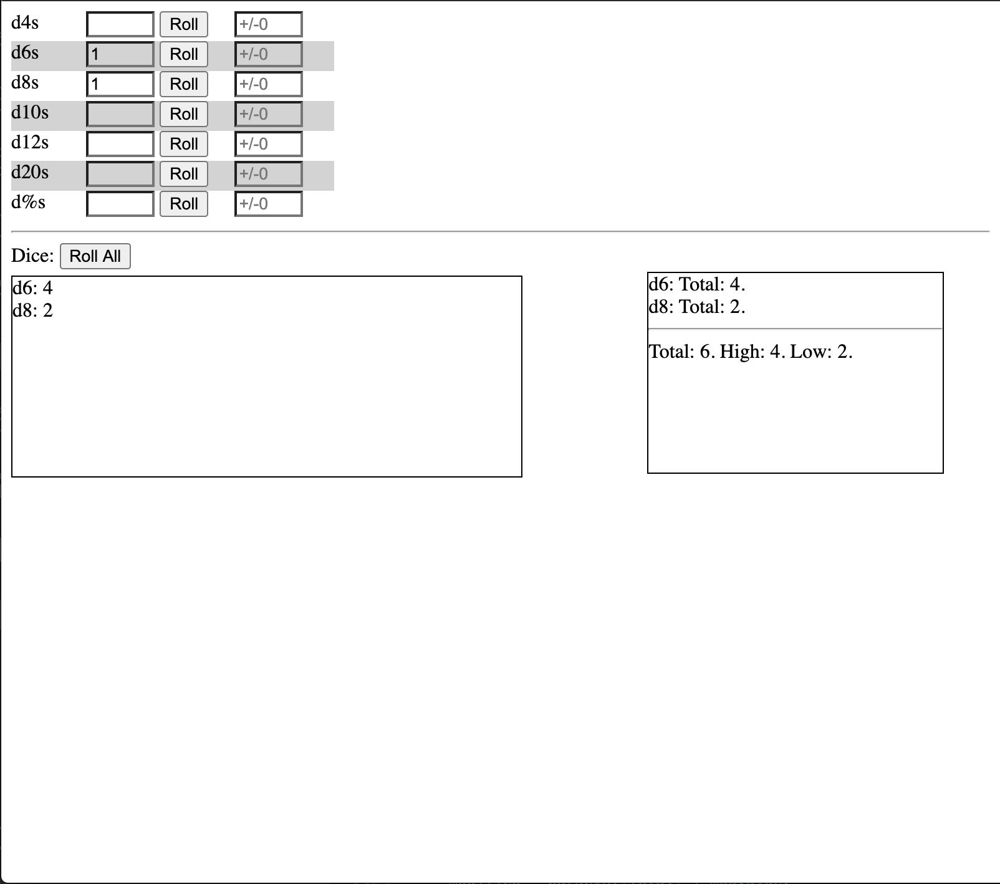
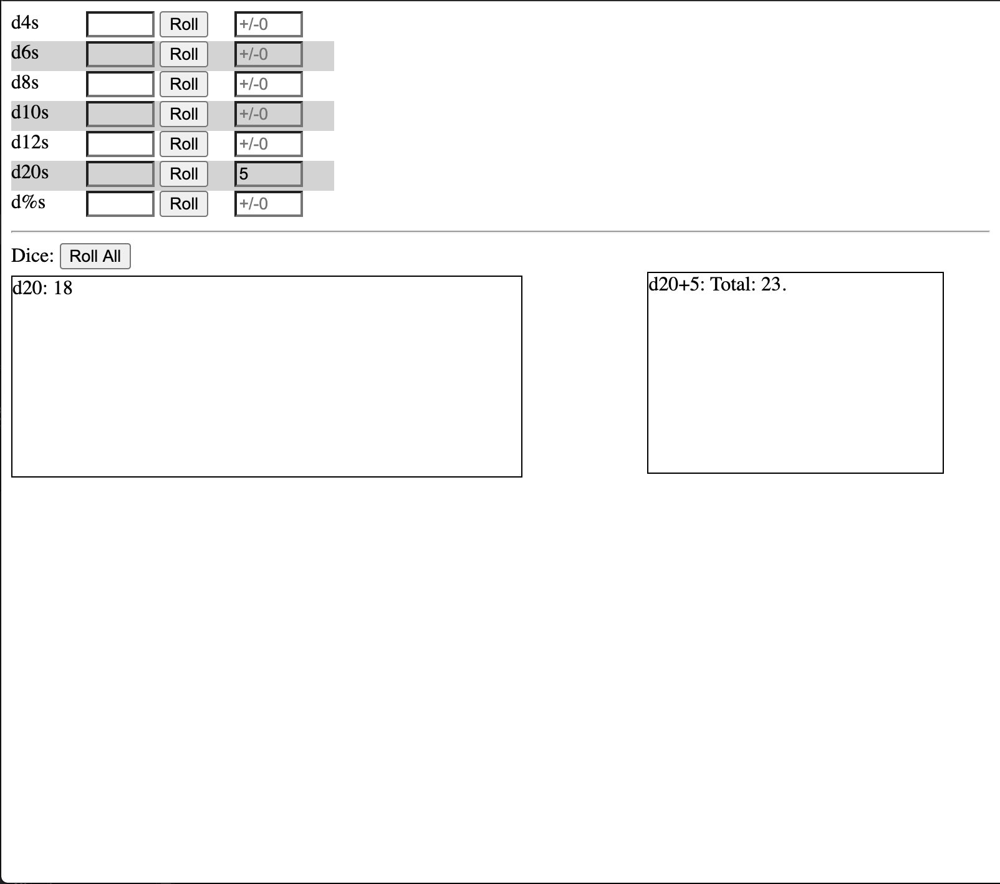
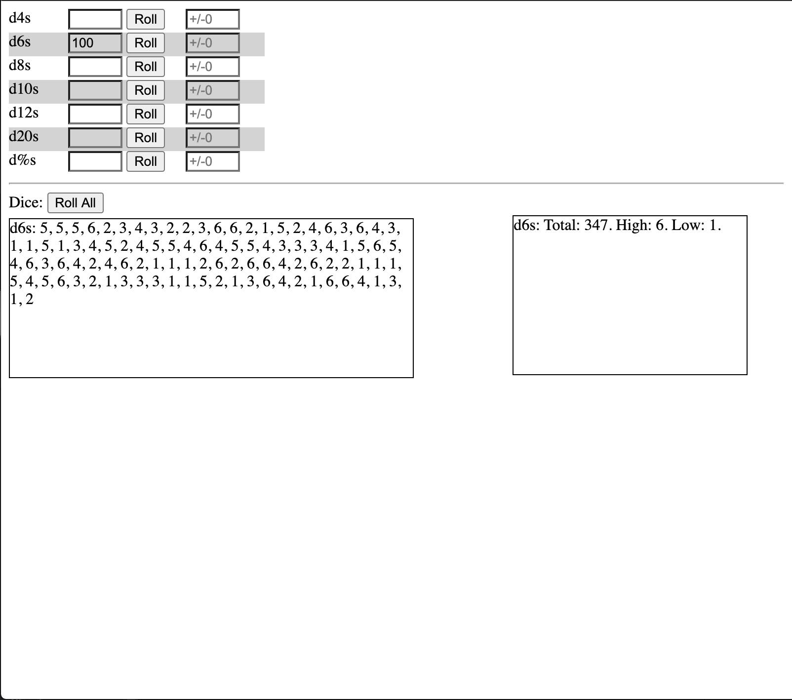
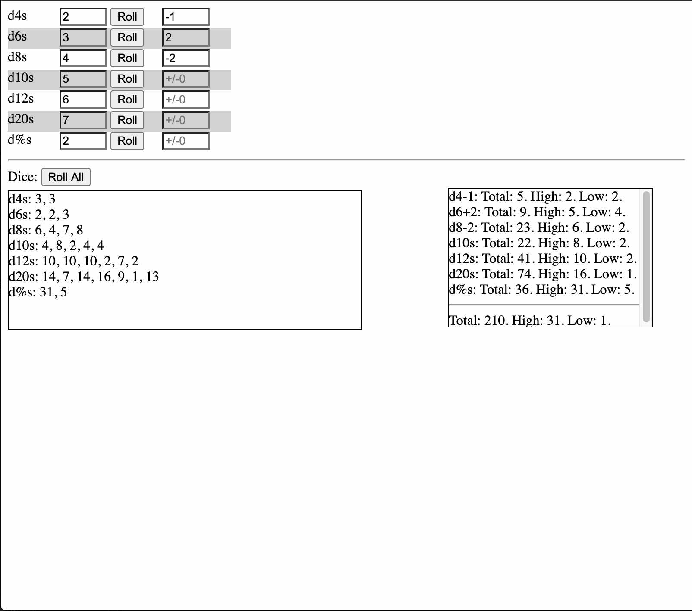

# dBags - One-Page Dice Roller
[](https://opensource.org/licenses/MIT)

> One more dice roller

I was tired of entering "Math.floor(Math.random() * x) in the console.
What I needed was a basic web page that would let me roll standard tabletop
game dice, while avoiding the standard pitfalls of a standard pseudorandom
number generator. 
Hence, dBags. The code is straightforward enough, with the actual randomizer
contained in the "DiceBag.js" file. Instead of generating each number using the
standard Math function, it takes a spread of values ranging along the entire
value set, seeds it with some pseudorandom numbers to keep it interesting, and
then shuffles with a simple random sort algorithm. For each dice set, it repeats
this process enough times to create a statistically significant superset that
makes the fourth or fifth roll much less predictable, while maintaining the
statistical integrity of the set as a whole.
That's dBags in a nutshell.


## User Story

```
AS A tabletop game player 
I WANT a single-page dice roller
SO THAT I can easily roll dice on my computer
```

```
GIVEN THAT I enter the number of dice I want
WHEN I roll
THEN I get raw results, as well as summary data like totals, high, and low results
WHEN I roll more than once
THEN I get a reasonable statistical spread of results, rather than a clump of high or low values
```
            


## Graphic


## Table of Contents
* [Technologies](#Technologies)
* [Getting Started](#Getting)
* [Usage](#Usage)
* [Project Status](#Project)
* [Frequently Asked Questions](#FAQ)
* [Questions](#Additional)
* [Contributing](#Contributing)
* [License](#License)
## Technologies
HTML\
CSS\
Javascript

## Getting Started
Nothing to install. You can open the HTML file in your browser.


## Usage
Enter the number of dice in the input box in the first column and the relevant
dice modifier, if any, in the second column. To roll a single type of die, click
the 'Roll' button beside the appropriate type. It will roll one die or the number
indicated in the box. To roll more than one die type, click the 'Roll All' button
at the bottom of the page. The page will generate dice rolls for all die types
indicated with a number in the box. Each modifier is applied separately to the
individual die types.
The unmodified dice rolls are listed for each die type in the field on the left
side. The modified total, high, and low results are listed in the summary field
on the right side at the bottom.






## Project Status
Done for Now

## FAQ
Why not a simple pseudorandom number generator?\
For me, d20s consistently roll a 1 or a 20 about every 1 in 5 rolls. Some nights,
it's about every 1 in 3 rolls. It sucks to be my players, let me tell you.
As such, I tend to prefer statistical results to actual ones. Pseudorandom 
generators tend to give me similar results.
Using statistical sets for my rolls lets me at least pretend that I don't live
in a Stoppard novel.


## Additional Questions
Drop me a line

## Contributing
Contact us for guidelines on submitting contributions.

## License
This project is licensed under the The MIT License.


### ionathas78

This file generated on 6/22/2020 by goodReadMeGenerator, copyright 2020 Jonathan Andrews

